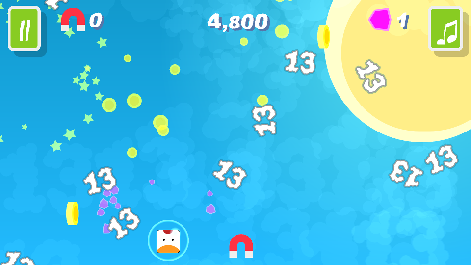

# Badluck Butter Chicken Flies The Unfriendly Skies.

Badluck butter chicken flies the unfriendly skies is my first 2024 entry for the annual JS13k competition, where you have a calendar month to shoehorn an entire game into a 13Kb zip file.

The game should also follow a set theme and this year the theme is "Triskaidekaphobia", the fear or avoidance of the number 13.

The game play revolves around avoiding the falling thirteens and collect coins, one of the most basic game mechanics you can get.

To spice things up a little bit you can collect several pickups; the shield that allows you for a time to deflect falling thirteens, and the magnet which attracts coins towards you for a time.

It sure could be more exciting but I'm relatively pleased with how it turned out.

## Post-Mortem

Mostly this year has been about improving my engine and I feel that I've accomplished that.

### Graphics

I learned more about SVG imagery, especially when it comes to generating them with code.

I'm feeling that next year I might try to improve my particle system. It functions but the effects you can achieve are kind of limited and there is no emitter functionality.

### Audio

This year I wanted to add some music to my entry, which required a complete rewrite of my audio code. Having accomplished that now I have gained a better understanding of the mysterious `AudioContext` object.

I managed to fit three musical scores into my entry which I feel is quite an accomplishment, even though they are quite short.

The audio code is now a mutation of [ZzFXM](https://github.com/keithclark/ZzFXM), which also includes [ZzFX](https://github.com/.KilledByAPixel/ZzFX)

### UI and UX

This year I threw out pretty much all of the UI code from last year and opted to generate everything as HTML elements and inject them into the relevant containers.

I also added a lot of code to manage pausing and unpausing both the game and audio. Also, I added code that manages the cases where the user switches tabs or clicks out of the browser to another program, pausing and resuming the game and audio as required.

I think this will be the UI code going forward from this year on.

## Workflow

This year I tried out [js13k-pack](https://github.com/xem/js13k-pack) by xem to minify my code and pack it up into a zip file. It had some issues with my SVG filters and I didn't like how that the HTML code couldn't have scripts or CSS in it, requiring much effort to make it work.

I took all of the good parts from js13k-pack and created my own monstrosity called shrinkwrap.

Basically with shrinkwrap you paste your HTM code into it and it will extract embedded CSS and scripts for you, as well as load any linked CSS and scripts.

All other functionality remains the same, it just has a few more configurable options and IMHO looks a bit nicer.

## Pushing the Envelope

This year I really didn't push very hard at the 13Kb limit. This game comes in at a whopping 10,126 bytes, which is 3kb short of the limit!

Now that my engine is pretty much sorted I feel that next year I'll try and push the limit as far as I can.

## Conclusion

Last year I was going to work more on actual gameplay this year but that fell by the way as I wasn't totally happy with my engine. Next year will be gameplay year, I promise.

As always if you have any questions then raise a GitHub issue and I'll do my best to accomodate your requests :)

See you all next year!
